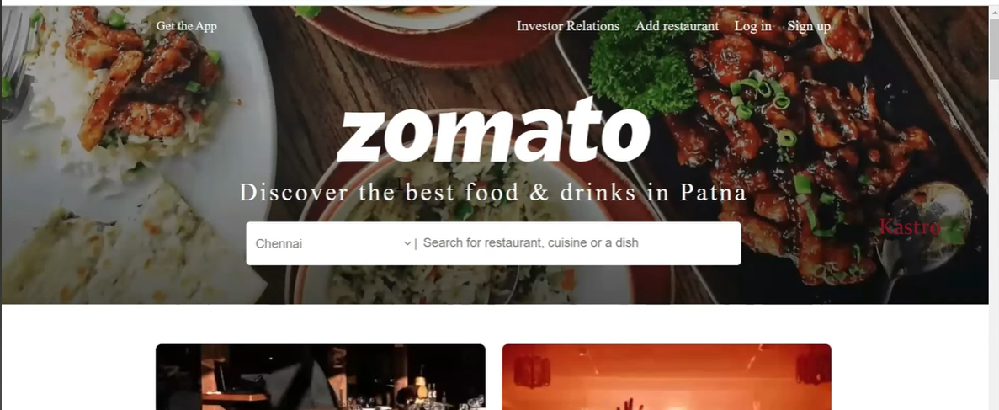

# Zomato Clone - DevOps Capstone Project

A comprehensive DevOps project demonstrating the deployment of a Zomato Clone application using modern DevOps tools, security practices, and CI/CD pipelines.

### Project Architecture
</img>

</img>

---

## 📋 Project Overview

This capstone project showcases the end-to-end deployment of a food delivery application clone using industry-standard DevOps practices. The project is divided into two main stages, progressively increasing in complexity and incorporating various DevOps tools for building, scanning, monitoring, and deploying applications.

## 🎯 Project Objectives

- Deploy a containerized Zomato Clone application
- Implement security scanning and vulnerability detection
- Build a robust CI/CD pipeline
- Deploy to Kubernetes with monitoring capabilities
- Demonstrate proficiency with modern DevOps toolchain

## 🚀 Project Stages

### Stage 1: Docker Container Deployment
In this stage, the application is containerized and deployed using Docker, establishing the foundation for scalable deployment.

**Key Activities:**
- Application containerization with Docker
- Image building and optimization
- Container deployment and management
- Security scanning of container images

### Stage 2: Kubernetes Deployment with Monitoring
This stage focuses on orchestrating the application in a Kubernetes cluster with comprehensive monitoring solutions.

**Key Activities:**
- Kubernetes cluster setup and configuration
- Application deployment using K8s manifests/Helm charts
- Implementation of monitoring and observability tools
- Service mesh configuration (if applicable)
- Health checks and auto-scaling

## 🛠️ Technologies & Tools

### Core Technologies
- **Containerization**: Docker
- **Orchestration**: Kubernetes
- **Version Control**: Git, GitHub

### DevOps Tools
- **CI/CD**: Jenkins / GitHub Actions / GitLab CI
- **Security Scanning**: Trivy / SonarQube
- **Monitoring**: Prometheus, Grafana
- **Container Registry**: Docker Hub / Amazon ECR
- **Infrastructure as Code**: Terraform / Ansible (if applicable)

## 📁 Project Structure

```
Zomato-Capstone-Project/
├── app/                    # Application source code
├── docker/                 # Docker configurations
│   ├── Dockerfile
│   └── docker-compose.yml
├── kubernetes/             # K8s manifests
│   ├── deployment.yaml
│   ├── service.yaml
│   └── ingress.yaml
├── monitoring/             # Monitoring configurations
│   ├── prometheus/
│   └── grafana/
├── scripts/                # Automation scripts
├── .github/workflows/      # CI/CD pipeline definitions
└── README.md
```

## 🔧 Prerequisites

Before you begin, ensure you have the following installed:

- Docker (v20.0 or higher)
- Kubernetes cluster (minikube, kind, or cloud provider)
- kubectl CLI tool
- Git
- CI/CD tool of choice (Jenkins/GitHub Actions)
- Helm (v3.x)

## 📦 Installation & Setup

### Stage 1: Docker Deployment

1. **Clone the repository**
   ```bash
   git clone https://github.com/Archesus/Zomato-Capstone-Project.git
   cd Zomato-Capstone-Project
   ```

2. **Build the Docker image**
   ```bash
   docker build -t zomato-clone:latest .
   ```

3. **Run the container**
   ```bash
   docker run -d -p 3000:3000 zomato-clone:latest
   ```

4. **Access the application**
   ```
   http://localhost:3000
   ```
### Push the image to Docker Hub
You can push your image to docker hub so that it can be pulled and used later.

</img>

---

### Stage 2: Kubernetes Deployment

1. **Set up Kubernetes cluster**
   ```bash
   # For local development with minikube
   minikube start --driver=docker
   ```

2. **Deploy to Kubernetes**
   ```bash
   kubectl apply -f kubernetes/
   ```

3. **Verify deployment**
   ```bash
   kubectl get pods
   kubectl get services
   ```

4. **Access the application**
   ```bash
   minikube service zomato-clone-service
   ```

## 🔒 Security Scanning

The project implements security scanning at multiple levels:

### Container Image Scanning
```bash
# Using Trivy
trivy image zomato-clone:latest
```

### Code Quality Analysis
```bash
# Using SonarQube
sonar-scanner \
  -Dsonar.projectKey=zomato-clone \
  -Dsonar.sources=. \
  -Dsonar.host.url=http://localhost:9000
```

## 📊 Monitoring & Observability

### Prometheus Setup
Deploy Prometheus for metrics collection:
```bash
kubectl apply -f monitoring/prometheus/
```

### Grafana Dashboard
Access Grafana for visualization:
```bash
kubectl port-forward svc/grafana 3000:3000
```

Default credentials: admin/admin

## 🔄 CI/CD Pipeline

The project includes automated CI/CD pipeline that:

1. **Build Stage**
   - Checks out code
   - Runs tests
   - Builds Docker image

2. **Security Stage**
   - Scans for vulnerabilities
   - Performs code quality checks
   - Checks for secrets in code

3. **Deploy Stage**
   - Pushes image to registry
   - Deploys to Kubernetes
   - Performs smoke tests

## 🧪 Testing

Run tests locally:
```bash
# Unit tests
npm test

# Integration tests
npm run test:integration

# E2E tests
npm run test:e2e
```

## 📈 Performance Optimization

- Container image optimization (multi-stage builds)
- Kubernetes resource limits and requests
- Horizontal Pod Autoscaling (HPA)
- Caching strategies

## 🐛 Troubleshooting

### Common Issues

**Issue**: Container fails to start
```bash
# Check container logs
docker logs <container-id>
```

**Issue**: Pod in CrashLoopBackOff
```bash
# Describe pod for details
kubectl describe pod <pod-name>
kubectl logs <pod-name>
```

## 🤝 Contributing

Contributions are welcome! Please follow these steps:

1. Fork the repository
2. Create a feature branch (`git checkout -b feature/AmazingFeature`)
3. Commit your changes (`git commit -m 'Add some AmazingFeature'`)
4. Push to the branch (`git push origin feature/AmazingFeature`)
5. Open a Pull Request

## 📝 License

This project is licensed under the MIT License - see the LICENSE file for details.

## 👤 Author

**KASTRO KIRAN V**

- GitHub: [@Archesus](https://github.com/Archesus)
- LinkedIn: [Connect on LinkedIn](https://www.linkedin.com/in/anurag-kumar-301243269/)

## 🙏 Acknowledgments

- Thanks to all contributors and the DevOps community
- Special thanks to mentors and reviewers
- Inspired by real-world DevOps practices

## 📞 Contact & Feedback

If you found this project helpful, please:
- ⭐ Star this repository
- 📢 Share on LinkedIn and tag me
- 💬 Provide feedback and suggestions

---

**Note**: This is a learning project for educational purposes. It demonstrates DevOps practices and is not intended for production use without proper security hardening and configuration.

## 🔗 Useful Links

- [Docker Documentation](https://docs.docker.com/)
- [Kubernetes Documentation](https://kubernetes.io/docs/)
- [DevOps Best Practices](https://www.devops.com/)
- [CI/CD Pipeline Guide](https://www.atlassian.com/continuous-delivery/principles)
